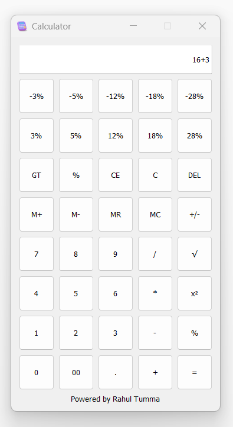

# PyQt5 Calculator

## Description
This is a simple calculator application built using PyQt5, a set of Python bindings for Qt libraries. It provides basic arithmetic operations such as addition, subtraction, multiplication, and division, along with additional features like percentage calculation, memory operations (memory addition, subtraction, recall, and clear), square root, and square of a number.

## Features
- Addition (+)
- Subtraction (-)
- Multiplication (*)
- Division (/)
- Percentage calculation (%)
- Memory operations (M+, M-, MR, MC)
- Square root (√)
- Square of a number (x²)
- Clear display (C)
- Delete last character (DEL)
- Change sign (+/-)
- Grand total recall (GT)

## Requirements
- Python 3.x
- PyQt5

## Usage
1. Install Python 3.x if you haven't already.
2. Install PyQt5 using the following command:
   ```bash
   pip install PyQt5
   ```
3. Run the calculator application by executing the `calculator.py` script:
   ```bash
   python calculator.py
   ```
4. Use the calculator interface to perform arithmetic operations.

## Screenshots


## License
This project is licensed under the MIT License - see the [LICENSE](LICENSE) file for details.

## Acknowledgements
- Powered by [Rahul Tumma](https://github.com/rahultumma)
